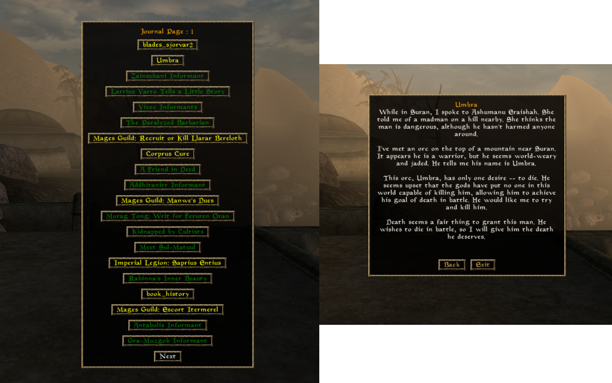

# Improved Tes3 quest journal

This plugin adds a new command for showing a custom quest journal with better ui.

It group all the journal entries into quests and makes them green if the quests are finished, and yellow if they're not.

### warning 
- due to game limits, some finished quests are considered unfinished and do not have a name assigned (eg `book_history`).
- plugin tested with only shared quests

# Installation 

- install [tes3mp](https://github.com/TES3MP/TES3MP/releases) 
- Drag all the files in server/scripts file
- Change the filepath in custom/questReader.lua to the absolute path of journal.txt
- launch the server and the client
- do `/journal`
- profit

# Improve :

### How it was made :

I got the entire dialog file of morrowind and parse it to make it more readable and limited with quest dialog.

I link the quests stored in the server to this file and show it with the custom menu.

### Installation

install lua :
 - [windows](https://github.com/rjpcomputing/luaforwindows/releases)
    .Add lua to path, do `lua.exe` to test script in console